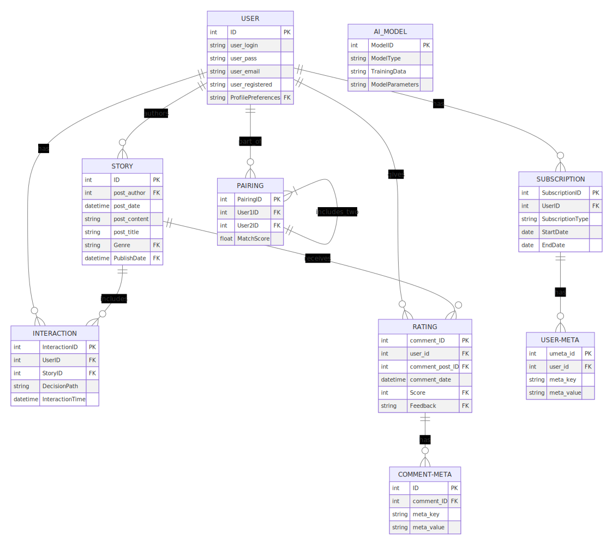

### Entity-Relationship Diagram (ER Diagram) unter Nutzung von WordPress Core Features

**Entities und ihre Entsprechung in WordPress:**

1. **User (wp\_users)**
    
    - Standard-Attribute: ID, user\_login, user\_pass, user\_email, user\_registered, etc.
    - Zusätzliche Attribute in `wp_usermeta`: ProfilePreferences, PairingPreferences, etc.
2. **Story (wp\_posts)**
    
    - Verwendung des Post-Typs 'story'.
    - Standard-Attribute: ID, post\_author, post\_date, post\_content, post\_title, etc.
    - Zusätzliche Attribute in `wp_postmeta`: Genre, PublishDate, etc.
3. **Pairing**
    
    - Eigene Tabelle oder Nutzung von `wp_postmeta` bzw. `wp_usermeta` für Pairing-Informationen.
    - Attribute: PairingID, User1ID, User2ID, MatchScore, etc.
4. **Interaction**
    
    - Nutzung von `wp_postmeta` für spezifische Interaktionsdaten.
    - Attribute: InteractionID, UserID, StoryID, DecisionPath, InteractionTime, etc.
5. **Rating (wp\_comments)**
    
    - Nutzung des Kommentarsystems von WordPress für Bewertungen.
    - Standard-Attribute: comment\_ID, user\_id, comment\_post\_ID, comment\_date, etc.
    - Zusätzliche Attribute in `wp_commentmeta`: Score, Feedback, etc.
6. **Subscription**
    
    - Eigene Tabelle oder Nutzung von `wp_usermeta` für Abonnementdaten.
    - Attribute: SubscriptionID, UserID, SubscriptionType, StartDate, EndDate, etc.
7. **AI\_Model**
    
    - Eigene Tabelle für AI-Modellinformationen.
    - Attribute: ModelID, ModelType, TrainingData, ModelParameters, etc.

**Relationships:**

- **User zu Story**: Nutzung von `post_author` in `wp_posts`.
- **User zu Interaction**: Informationen in `wp_postmeta`.
- **User zu Pairing**: Eigene Tabelle oder `wp_usermeta` für Paarbeziehungen.
- **User zu Rating**: Nutzung von `comment_post_ID` und `user_id` in `wp_comments`.
- **Story zu Interaction**: Story-ID und Interaktionen in `wp_postmeta`.
- **Story zu Rating**: Verknüpfung über `comment_post_ID` in `wp_comments`.

### Optimierungen

- **Indizes**: Nutzung von WordPress-internen Indizes und ggf. Hinzufügen eigener Indizes für häufig abgefragte Spalten.
- **Foreign Keys**: Nutzung von WordPress ID-Strukturen für Beziehungen zwischen den Tabellen.
- **Datenstrukturen**: Optimierung durch die Auswahl geeigneter Datenstrukturen im Einklang mit WordPress-Standards.

### JSON Files für ACF

Die Erstellung von Custom Fields mit ACF für die individuellen Bedürfnisse der oben genannten Entities kann wie bereits früher beschrieben umgesetzt werden.

**Hinweis:** Die Integration mit WordPress Core-Features und die Nutzung von Standardtabellen ermöglichen eine effiziente und wartungsfreundliche Entwicklung des "IntimateTales" Plugins. Es wird empfohlen, die Struktur und Beziehungen der Daten regelmäßig zu überprüfen und an die sich entwickelnden Anforderungen des Projekts anzupassen.